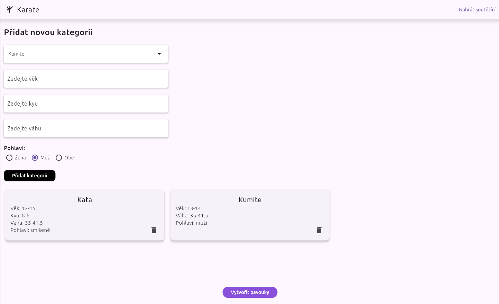

# Sport brackets
This repository contains an application for generating sports brackets specifically for karate. It was developed upon request for a local karate club that organizes small tournaments.

## Overview
- The user sets categories for the tournament using a GUI. Once the categories are defined, they must load the URL of a Google Sheet containing all participants in a specific format. After that, the user can press a button to generate the brackets. The brackets are drawn on A4 PDF pages, with each page dedicated to a single category. The generated PDFs are saved in the program folder under a specific name. The user can then print the file, and the tournament setup is complete.

# Screenshots
### Brackets
- This is an example of a generated bracket. Each pair of brackets has two colors because, in karate tournaments, one competitor wears a blue belt and the other wears a red belt. This ensures that belt colors are decided in advance. The four rows in the right bottom corner are used to specify the four best competitors of the category (there are two third places).
***

***
### GUI
- The form allows the user to set a category. They can select a category name from the dropdown menu or create a new one. Leaving a field blank means that all participants will meet that condition.
***

***
## License
This project is licensed under the GNU General Public License v3.0 - see the LICENSE file for details.
